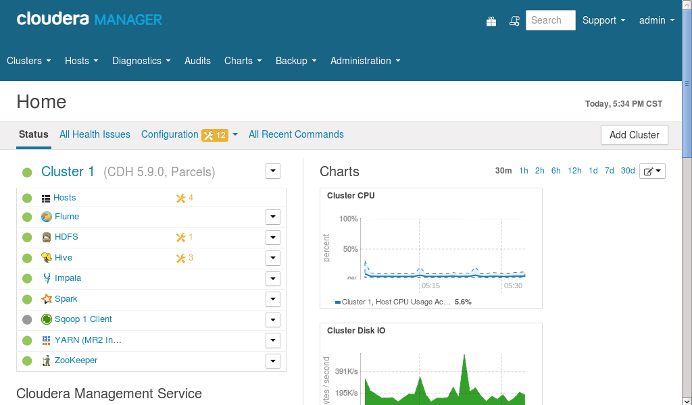

# CDH安装手册（更新中……）
## 前言
> CDH是[Cloudera公司](https://www.cloudera.com/)对应Hadoop的一个发行版本，具有易于安装、部署、操作、图形化界面等特点。本手册致力于帮助新手安装、部署CDH集群，顺利渡过CDH集群的初期问题。需要注意的是，本手册基于的是实验环境，并非实际生产环境，具体参数需要根据实际场景修改。

- Cloudera发行版安装主要分为2个部分：
	- Cloudera Manager （对于集群的管理、部署等）
	- Cloudera Distribute Hadoop （实际集群的组件等）
- Cloudera官方文档(推荐)
	- https://www.cloudera.com/documentation/enterprise/latest.html 

## 安装包下载
- [CentOS-6.5-x86_64](./project/download/CentOS_download/CentOS_download.md)
- [CM安装包](./project/download/CM_download/CM_download.md)
- [CDH安装包](./project/download/CDH_download/CDH_download.md)
- [MySQL的JDBC包](./project/download/MySQL_JDBC_download/MySQL_JDBC_download.md)
- Cloudera提供的JDK安装包（上面的CM包中自带JDK安装包）

	**注：1.Centos必须是64位 2.CM版本应大于等于CDH版本 3.JDK尽量选Cloudera提供的**

## CentOS安装
- [点我查看安装详细内容](./project/CentOS_install/CentOS_install.md)

## 环境准备
1. [架构理解，准备服务器](./project/prepare/cm_framework/cm_framework.md)
2. [关闭防火墙](./project/prepare/stop_firewall/stop_firewall.md)
3. [配置hostname、静态IP、hosts文件](./project/prepare/host_ip/host_ip.md)
4. [关闭SELinux](./project/prepare/disabling_SELinux/disabling_SELinux.md)
5. [修改swapiness](./project/prepare/swappiness/swappiness.md)
6. [内存问题，关闭THP](./project/prepare/disabling_transparent_hugepages/disabling_transparent_hugepages.md)
7. [配置ssh免密码登录](./project/prepare/ssh/ssh.md)
8. [安装Java](./project/prepare/install_java/install_java.md)
9. [上传JDBC包](./project/prepare/JDBC/JDBC.md)
10. [MySQL安装与准备](./project/prepare/mysql/mysql.md)
11. [NTP时间同步](./project/prepare/ntp/ntp.md)
12. [配置HTTP协议仓库](./project/prepare/http/http.md)

## CM安装
1. [开始安装CM5](./project/setup/cm.md)
2. [安装每个节点的Agent](./project/setup/cm.md)

## CDH安装
- [坑位（暂时请在网上搜索一下吧，很简单的QWQ!CDH几乎就是哪里不会点哪里...So easy!!^_^~!）](https://github.com/AlionSSS/CDH-Install-Manual)
- 也可以联系我!=3=~ QQ: 444066154

## 界面预览


## LICENSE
```
Copyright 2017 ALion

Licensed under the Apache License, Version 2.0 (the "License");
you may not use this file except in compliance with the License.
You may obtain a copy of the License at

	http://www.apache.org/licenses/LICENSE-2.0

Unless required by applicable law or agreed to in writing, software
distributed under the License is distributed on an "AS IS" BASIS,
WITHOUT WARRANTIES OR CONDITIONS OF ANY KIND, either express or implied.
See the License for the specific language governing permissions and
limitations under the License.
```
