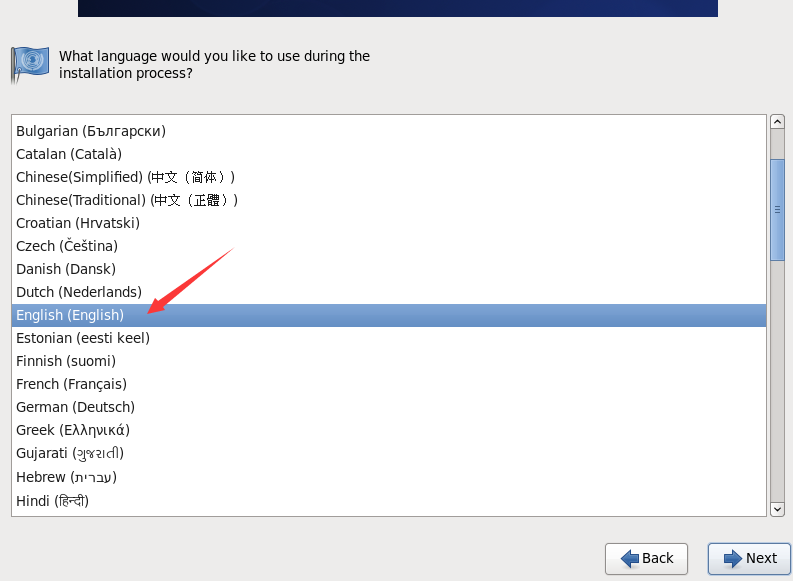
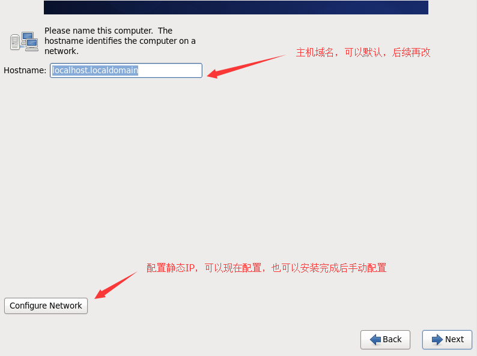
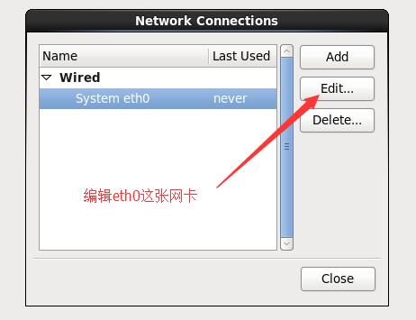
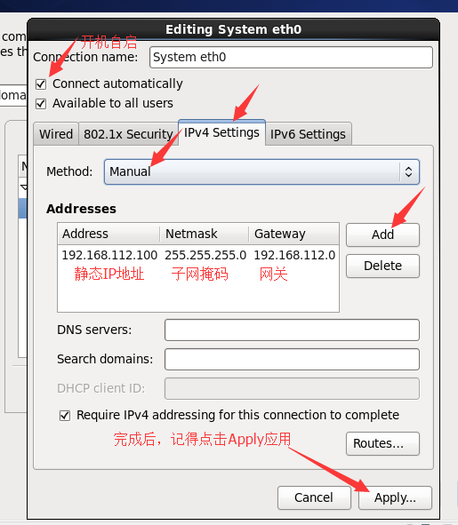
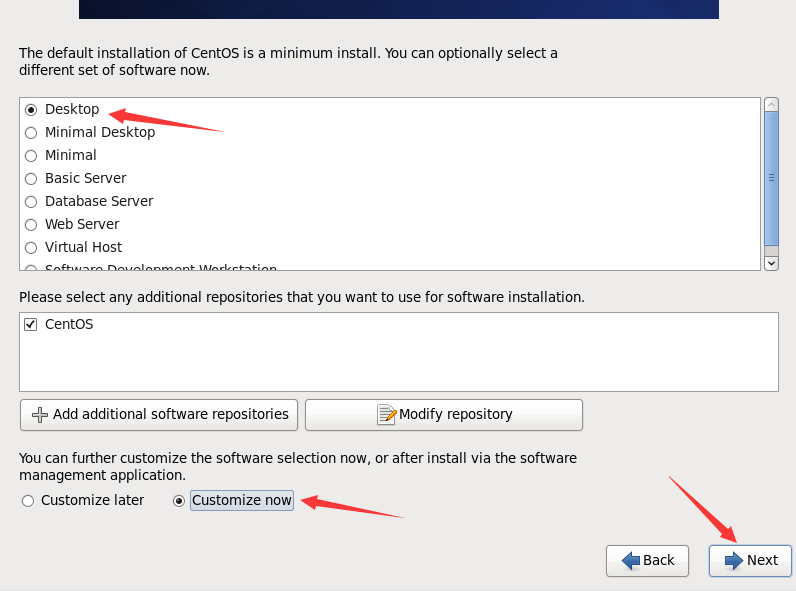
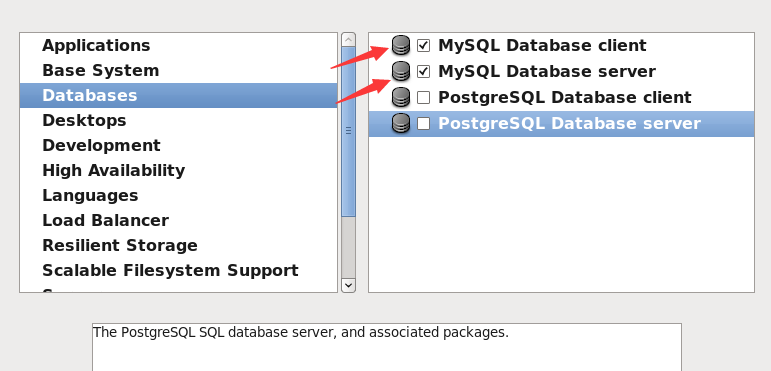
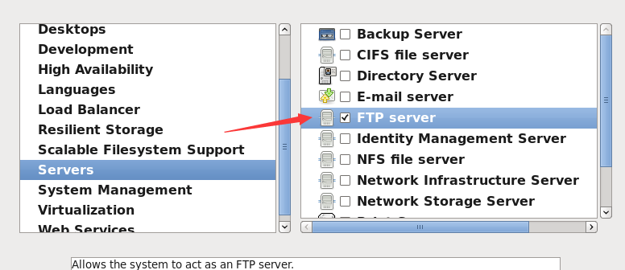
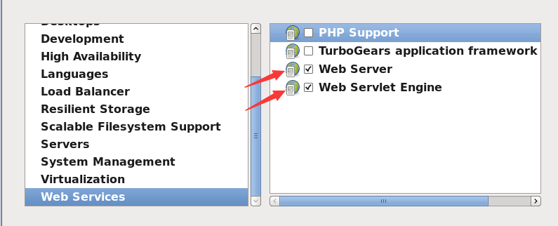

## CentOS 安装注意事项

1. 系统版本 6.5 x86_64
2. 虚拟机网络模式 NAT
3. 内存 2048MB (有条件的，更大好些)
4. 硬盘大小 30-50G
5. 语言选择 English
6. 可在安装界面配置静态IP，或者后续手动配置
7. 账户创建：一个root、一个普通用户
8. 分区： / 根分区一定要大，一定要大，一定要大！
9. 安装包选择(除默认外)
	- 勾选: FTP、Server服务、MySQL
	- 不勾选： java

## 安装教程参考 
- 地址: http://jingyan.baidu.com/article/25648fc1a235c99191fd0008.html
- 注意: 此链接仅供参考，具体注意事项请参考上述内容

## 安装截图参考
- 选择 English

- 主机域名、静态IP

- 选择 编辑网卡eth0

- 编辑网卡eth0 详细设置

- 选择自定义安装

- 去掉安装java

- 安装MySQL

- 安装FTP

- 安装web service

