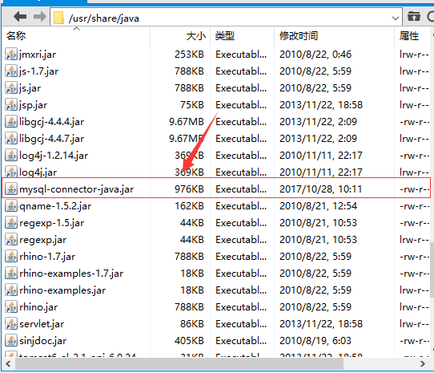

### 上传JDBC包
由于我们使用的MySQL数据库，所以采用了MySQL官网提供的JDBC包(mysql-connector-java-5.1.44.tar.gz)，为集群的组件运行提供了数据库调用的API

### 操作
1. 下载
	- 请参考[安装包下载-MySQL的JDBC包](../../download/MySQL_JDBC_download/MySQL_JDBC_download.md)步骤
2. 上传
	- 切换到将要安装CM的服务器lion上 
	- 解压mysql-connector-java-5.1.44.tar.gz，并修改其名称为mysql-connector-java.jar
	- 在本地开启你的FTP软件，这里我们采用XFtp
	- 上传mysql-connector-java.jar至/usr/share/java目录下

### 可能出现的问题
- 兼容性问题：MySQL版本和mysql-connector-java.jar可能出现版本不兼容问题，详情请于[MySQL官网](https://www.mysql.com/)查询
- 上传失败：用户权限不够，请切换至root账户再上传。或者先上传至本用户目录下，再使用sudo mv命令将其移动至/usr/share/java目录下

### 截图
- mysql-connector-java.jar上传的位置

