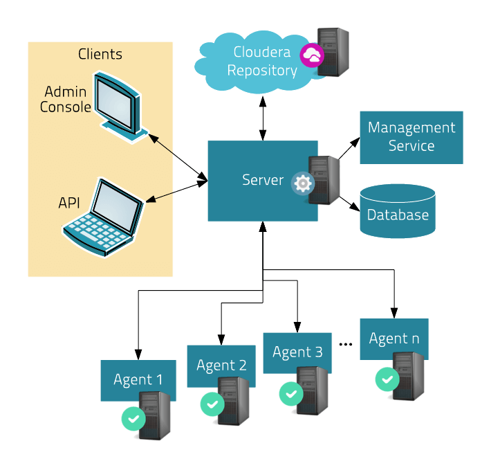

## 架构理解，准备服务器

### CM架构图

### 架构简介
1. 主要由1台Manager Service服务器（图中间部分）和多台台CM Agent服务器（图下部分）构成
2. 1台Manager Service服务器控制多台Agent服务器
	- Manager Servic服务器装有: CM Service、关系型Database、安装包仓库（图上中部分）
	- Agent服务器装有: CM Agent
3. 外部通过主机（图中左上部分）向Manager Servic服务器发送命令，控制整个集群安装、部署（安装包从安装包仓库获取）

**注意：**
1. Server、Agent的所有服务器为内部网络，对外封闭，只能由Admin主机控制
2. 由于不能连接外网，安装包仓库只能通过本地建立HTTP协议仓库
3. 如果可以连接外网，可以从Cloudera的云端服务器获取安装包

### 服务器部署分配
实验用5台服务器名称: elephant, tiger, horse, monkey, lion
- Manager Service服务器: lion
	- Manager Service
	- MySQL数据库
	- HTTP协议仓库（Apache）
- Agent服务器: elephant, tiger, horse, monkey, lion
	- Agent
