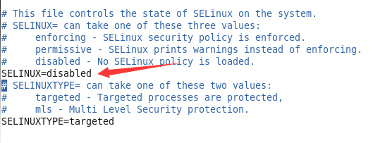

## 关闭SELinux

### 操作(包括5台服务器)
1. 检查SELinux状态 $ getenforce
2. 永久方法，修改/etc/selinux/config文件中设置SELINUX=disabled（重启服务器后生效）
3. 临时方法，使用命令setenforce 0
 
附：(1) $ setenforce 1 设置SELinux 成为enforcing模式 (2) $ setenforce 0 设置SELinux 成为permissive模式

### 参考资料
- [Cloudera的Disabling SELinux资料地址](https://www.cloudera.com/documentation/enterprise/latest/topics/install_cdh_disable_selinux.html)

### 操作截图

- 修改/etc/selinux/config文件

