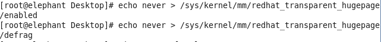
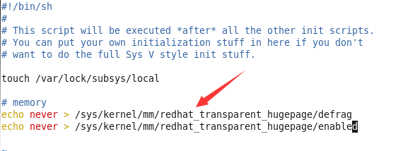

## 内存问题，关闭THP

CentOS6引入了THP的特性，优化了内存申请的效率，而Hadoop是高密集型内存运算系统，这个改动给hadoop带来了副作用。

### 操作(包括5台服务器)
- 关闭THP
	$ echo never > /sys/kernel/mm/redhat_transparent_hugepage/defrag
	$ echo never > /sys/kernel/mm/redhat_transparent_hugepage/enabled
- 设置开机自动关闭THP
	- vim /etc/rc.local
	- 添加下面两句
	- echo never > /sys/kernel/mm/redhat_transparent_hugepage/defrag
	- echo never > /sys/kernel/mm/redhat_transparent_hugepage/enabled
- 注：CentOS7中前缀路径是/sys/kernel/mm/transparent_hugepage

### 参考资料
- [Cloudera的Optimizing Performance in CDH资料地址](https://www.cloudera.com/documentation/enterprise/latest/topics/cdh_admin_performance.html#cdh_performance__section_hw3_sdf_jq)
- [Redhat的HugePages资料地址](https://access.redhat.com/documentation/en-US/Red_Hat_Enterprise_Linux/6/html/Performance_Tuning_Guide/s-memory-transhuge.html)

### 操作截图
- 关闭THP

- 设置开机自动关闭THP

