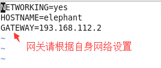
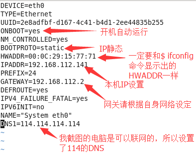
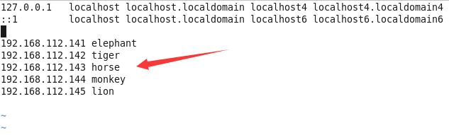

## 配置hostname、ip、hosts

### 先确定5台服务器内网IP分配
- elephant -> 192.168.112.141
- tiger -> 192.168.112.142
- horse -> 192.168.112.143
- monkey -> 192.168.112.144
- lion -> 192.168.112.145

### 修改hostname
- 修改5台服务器各自对应的hostname
- 示例 elephant
	- $ vim /etc/sysconfig/network (CentOS7为/etc/hostname文件)
	- 编辑HOSTNAME=elephant, 保存
	- 关机后将永久生效
	- 临时生效命令 $ hostname elephant
	- 截图

	

### 配置静态IP
- 修改5台服务器各自对应的静态IP
- 示例 elephant
	- $ vim /etc/sysconfig/network-scripts/ifcfg-eth0
	- 截图

	
	- 重启网络 $ service network restart

### 配置hosts文件
- 修改5台服务器的hosts文件
- 示例 elephant
	- $ vim /etc/hosts
	- 截图

	
	
### 网络测试
在每台服务器执行以下命令，确定网络配置正确
- 确定本机域名 
	- $ hostname
- 查看是否能与其他服务器连接网络 
	- $ ping elephant
	- $ ping tiger
	- $ ping horse
	- $ ping monkey
	- $ ping lion
- 如果出现问题，请检查是否符合上述的配置，然后重启，确保配置生效，再检查网络连接
