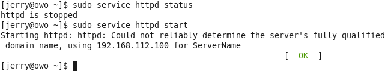
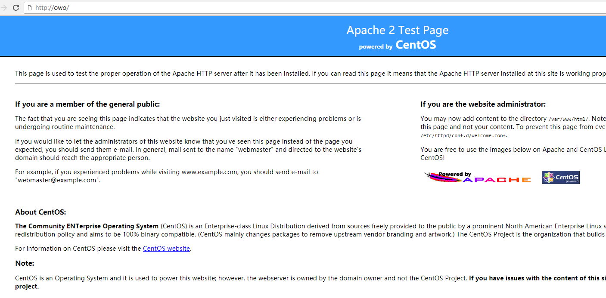
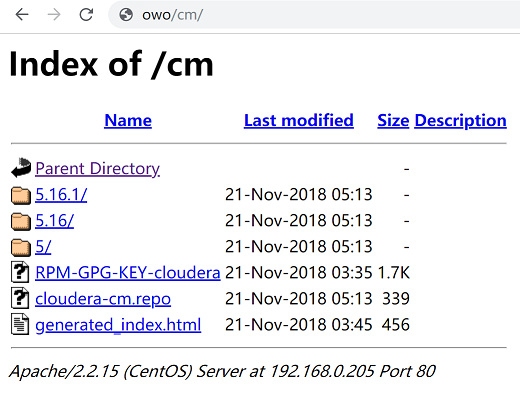
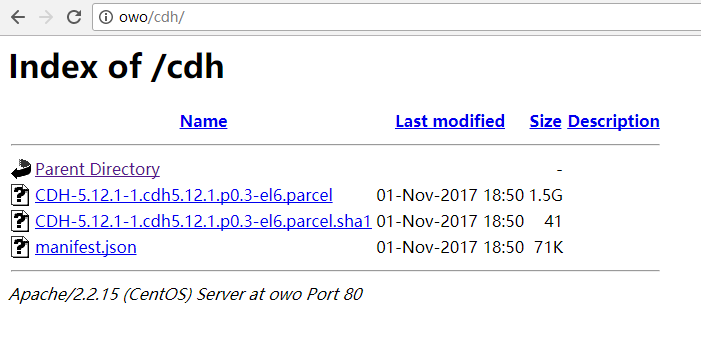
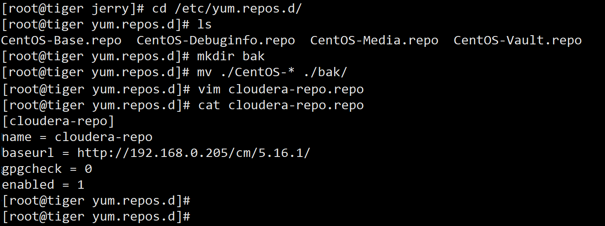

## 配置本地yum源
我们默认在封闭的网络内部安装集群，将parcel包放置在HTTP协议仓库，可以让ClouderaManager命令Agent去下载内部HTTP仓库的文件。这样免去了手动分发到各个节点的麻烦。

### 操作1(选择在lion部署）
1. 如果按照之前的CentOS安装步骤，那么系统是默认自带Apache HTTP服务的
	- Apache HTTP下载地址：http://httpd.apache.org/download.cgi
2. 开启httpd服务 $ service httpd start
3. 尝试使用浏览器访问其Web UI界面 例如：http://owo
4. 将下载的cm和cdh包都存到/var/www/html下
5. 解压cm包 $tar -xvf cm5.16.1-centos6.tar.gz
6. 创建/var/www/html/cdh目录，将cdh包放入该目录
7. 使用浏览器访问http仓库 http://owo/cm 和 http://owo/cdh

注：请严格按照截图中的路径存放cm和cdh包

### 操作2(所有节点）
1. 进入yum仓库路径 $ cd /etc/yum.repos.d/
2. 创建备份目录bak，将原仓库文件放入其中
3. 创建cloudera-repo.repo文件，并加入HTTP仓库路径等信息（具体操作请看截图）

### 操作截图
- 开启httpd服务

- Apache界面

- http仓库cm

- http仓库cdh

- 配置yum源仓库

