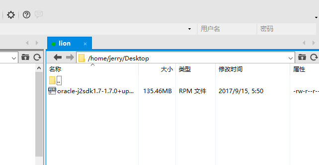
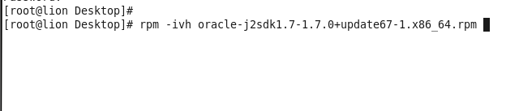
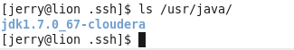
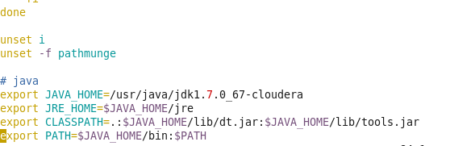
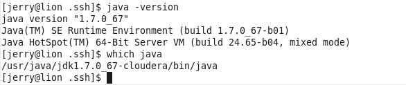

## 安装Java
Java有很多版本，虽然多数版本都能让CDH集群运行起来，但是很可能有未知的问题。使用Cloudera官方提供的Java版本，能够避免极大多数的Java版本引起的问题，从而避免未知的风险。

### 操作（包括elephant tiger horse monkey lion）
1. 解压之前下载的cm5.12.1-centos6.tar.gz，在cm5.12.1-centos6\cm\5.12.1\RPMS\x86_64找到oracle-j2sdk1.7-1.7.0+update67-1.x86_64.rpm
2. 使用FTP工具（我用的Xftp软件）上传之前下载的oracle-j2sdk1.7-1.7.0+update67-1.x86_64.rpm包到elephant tiger horse monkey lion服务器上
3. 找到上传的包对应的位置，安装java，执行 $ rpm -ivh oracle-j2sdk1.7-1.7.0+update67-1.x86_64.rpm(或者yum -y install ./oracle-j2sdk1.7-1.7.0+update67-1.x86_64.rpm)
4. 开始安装Java，等待完成（成功安装的话，java应该在/usr/java/jdk1.7.0_67-cloudera处）
5. 配置Java环境变量
	- $ vim /etc/profile
	- 在文件末尾添加如下内容
	```
	# java
	export JAVA_HOME=/usr/java/jdk1.7.0_67-cloudera
	export JRE_HOME=$JAVA_HOME/jre
	export CLASSPATH=.:$JAVA_HOME/lib/dt.jar:$JAVA_HOME/lib/tools.jar
	export PATH=$JAVA_HOME/bin:$PATH
	```
	- 使其生效 $ source /etc/profile
6. 检查java是否配置良好
	- $ java
	- $ java -version
	- $ which java (确认java是否指向cloudera提供的java安装的位置)
7. 当然你想安装Java8也可以，cdh也支持。目前我使用过jdk-8u144，其他具体版本请参照[Cloudera官方推荐JDK的版本](https://www.cloudera.com/documentation/enterprise/release-notes/topics/rn_consolidated_pcm.html#pcm_jdk) 处的Oracle JDK 8 versions that are tested and recommended

### 参考资料
- [Cloudera官方文档 Java Development Kit Installation](https://www.cloudera.com/documentation/enterprise/latest/topics/cdh_ig_jdk_installation.html)
- [Cloudera官方文档 Oracle JDK Installation](https://www.cloudera.com/documentation/cdh/5-1-x/CDH5-Installation-Guide/cdh5ig_oracle_jdk_installation.html)

### 操作截图
- FTP工具上传Java包



- 安装java



- 查看java安装位置




- 配置Java环境变量




- 检查java是否配置良好


