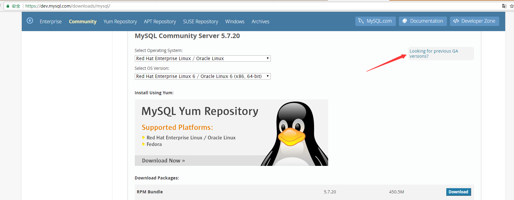
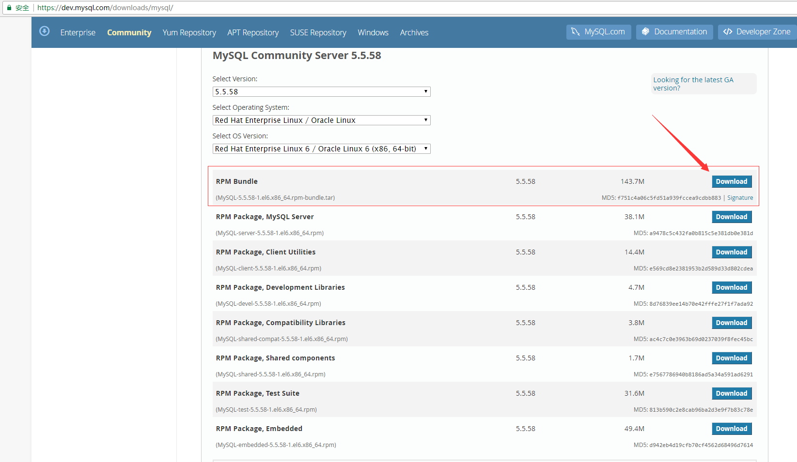
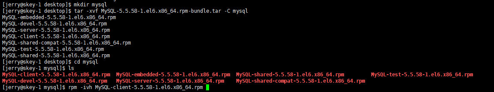
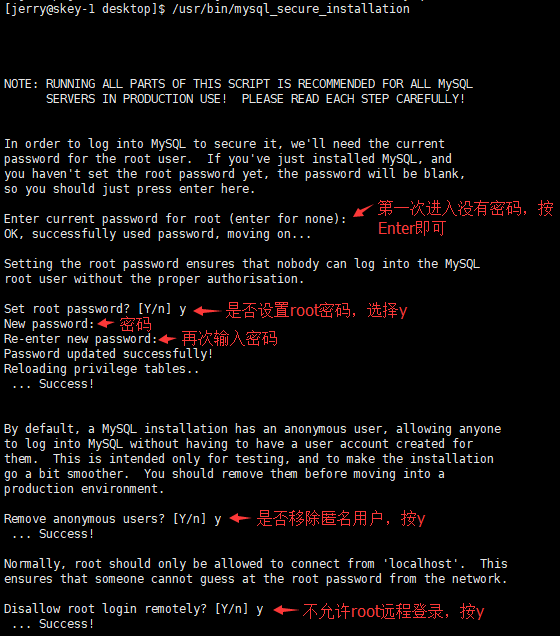
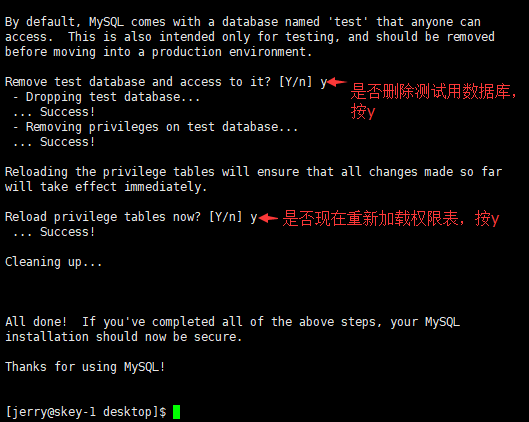

##  MySQL安装与准备
在服务器上安装MySQL，同时建库建用户，主要是为了CM管理集群提供关系型数据库支持，为各个组件提供关系型数据库服务

### 操作
1. 如果你已经按照[CentOS安装](../../CentOS_install/CentOS_install.md)的步骤中指出的勾选了MySQL选项，那么请跳转至第3步，否则从第2步开始
2. 下载与安装MySQL
	- 本次选择的服务器是将要安装CM的服务器lion
	- 从官网下载https://dev.mysql.com/downloads/mysql/
	- 选择需满足两点：1.MySQL Community Server 5.5.58 2.Red Hat Linux 6
	- 下载RPM Bundle
	- 使用tar -xvf解压RPM Bundle，生成的文件包括几个RPM包
	- 使用rpm -ivh安装所有下载的rpm包
	- 附：[下载与安装可供参考的链接](http://www.linuxidc.com/Linux/2015-01/111413.htm)
3. 准备
	- 本次选择的服务器是将要安装CM的服务器lion
	- 启动mysqld服务 $ service mysqld start
	- 初次登录mysql数据库 $ mysql -u root -p (注：初次登录不需要密码，直接按Enter即可)
	- 建库建用户，执行sql语句(为后续将要使用到的组件创建库、用户)
	```sql
	CREATE DATABASE cmserver DEFAULT CHARACTER SET utf8;
	GRANT ALL on cmserver.* TO 'cmserveruser'@'%' IDENTIFIED BY 'password';
	
	CREATE DATABASE metastore DEFAULT CHARACTER SET utf8;
	GRANT ALL on metastore.* TO 'hiveuser'@'%' IDENTIFIED BY 'password';
	
	CREATE DATABASE amon DEFAULT CHARACTER SET utf8;
	GRANT ALL on amon.* TO 'amonuser'@'%' IDENTIFIED BY 'password';
	
	CREATE DATABASE rman DEFAULT CHARACTER SET utf8;
	GRANT ALL on rman.* TO 'rmanuser'@'%' IDENTIFIED BY 'password';
	
	CREATE DATABASE oozie DEFAULT CHARACTER SET utf8;
	GRANT ALL on oozie.* TO 'oozieuser'@'%' IDENTIFIED BY 'password';
	
	CREATE DATABASE hue DEFAULT CHARACTER SET utf8;
	GRANT ALL on hue.* TO 'hueuser'@'%' IDENTIFIED BY 'password';
	```
	- MySQL安装设置初始化（详情请看截图） $ sudo /usr/bin/mysql_secure_installation

### 截图
- 下载与安装MySQL





- 启动mysqld服务


- 初次登录mysql数据库


- MySQL安装设置初始化



