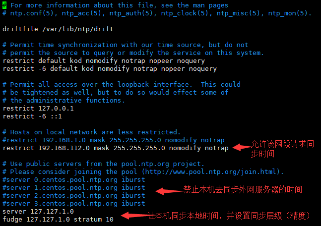
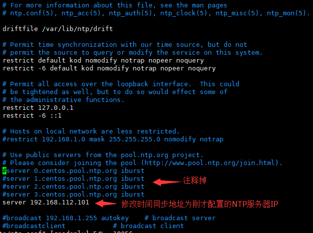
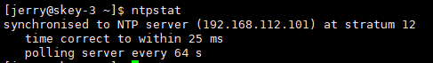
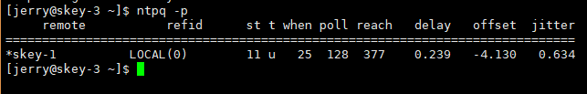

##  NTP时间同步
NTP服务为集群提供了时间同步服务，在CDH集群中各个组件需要用到它，例如节点的健康状态监控、心跳包时间问题等等。我们需要一台服务器提供NTP时间同步服务，其他几台服务器向这台服务器请求时间同步即可。需保证服务器之间时间范围差小于30秒。

### 操作
- NTP时间同步提供的服务机（lion）
	1. 编辑ntp配置文件 $ vim /etc/ntp.conf
	2. 设置允许某个网段的IP向本机请求同步时间 restrict 192.168.112.0 mask 255.255.255.0 nomodify notrap
	3. 注释掉默认的时间同步地址，添加时间同步地址为本机 server 127.127.1.0
	4. 设置本地时钟源的层次 fudge 127.127.1.0 stratum 10
- 请求NTP时间同步的客户机（elephant、tiger、horse、monkey）
	1. 编辑NTP配置文件 $ vim /etc/ntp.conf
	2. 注释掉默认的时间同步地址，添加时间同步地址为lion的地址 server 192.168.112.101
- 启动NTP服务（lion、elephant、tiger、horse、monkey）
	1. 启动命令 $ service ntpd start
	2. 查看同步状态 $ ntpstat
	3. 如果出现 synchronised to NTP server (192.168.112.101) 即同步成功
	4. 查看当前同步设置 $ ntpq -q 
	
**注意事项：**
1. 网段与IP请参考自身情况设置 
2. 启动NTP服务后，如果要查看同步状态，需要等待约为5-10分钟，才能看到synchronised已同步字段
3. 如果仍未显示synchronised，请尝试重启NTP服务 $ service ntpd restart
	
### 可供参考的链接
- [配置NTP服务ntpd/ntp.conf（搭建Hadoop集群可参考）](http://blog.csdn.net/bluishglc/article/details/41413031)
- [ntp服务器查看状态命令ntpstat及ntpq -p 说明及差别详解](http://blog.chinaunix.net/uid-29179844-id-4610083.html)

### 截图
- 服务机（lion）的配置

- 客户机（elephant、tiger、horse、monkey）的配置

- 启动NTP服务5-10分钟后，同步成功

- 查看当前同步设置

