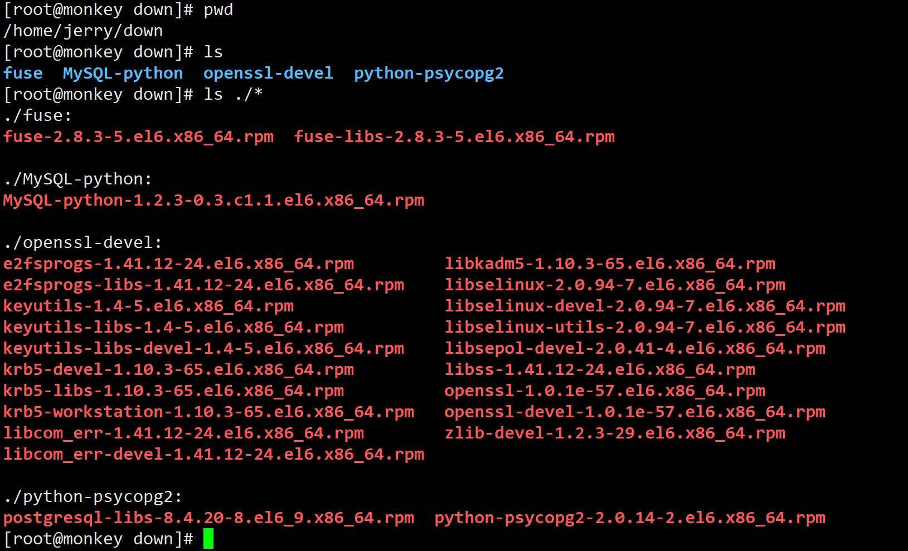

## 安装系统依赖的其他包

Cloudera Manage的安装，除了自带的安装包外，还需要依赖其他多个对应版本的包，例如openssl。这样CM才能正常进行安装，不然总会在“群集安装-Install Agents”步骤出错！

### 操作（所有节点）
1. 在任意目录解压前面下载好的包 $tar -xvf other_packages.tar.gz
2. 查看所有包 $ ls ./*
3. 请按照下面给的顺序一一安装，不要乱序，容易出问题。

``` shell
# 安装python-psycopg2
rpm -ivh python-psycopg2/postgresql-libs-8.4.20-8.el6_9.x86_64.rpm 
rpm -ivh python-psycopg2/python-psycopg2-2.0.14-2.el6.x86_64.rpm 

# 安装fuse
rpm -ivh fuse/fuse-2.8.3-5.el6.x86_64.rpm 
rpm -ivh fuse/fuse-libs-2.8.3-5.el6.x86_64.rpm 

# 安装MySQL-python
rpm -ivh MySQL-python/MySQL-python-1.2.3-0.3.c1.1.el6.x86_64.rpm

# 安装openssl
# 安装openssl - krb5-devel
# 安装openssl - krb5-devel - libcom_err-devel
rpm -e --nodeps libcom_err-1.41.12-18.el6.x86_64
rpm -ivh openssl-devel/libcom_err-1.41.12-24.el6.x86_64.rpm
rpm -ivh openssl-devel/libcom_err-devel-1.41.12-24.el6.x86_64.rpm
# 安装openssl - krb5-devel - krb5-libs
rpm -e --nodeps krb5-libs-1.10.3-10.el6_4.6.x86_64
rpm -ivh openssl-devel/krb5-libs-1.10.3-65.el6.x86_64.rpm
# 安装openssl - krb5-devel - libkadm5(x86-64)
rpm -ivh openssl-devel/libkadm5-1.10.3-65.el6.x86_64.rpm
# 安装openssl - krb5-devel - libselinux-devel
rpm -ivh openssl-devel/libsepol-devel-2.0.41-4.el6.x86_64.rpm
rpm -e --nodeps libselinux-utils-2.0.94-5.3.el6_4.1.x86_64
rpm -Uvh openssl-devel/libselinux-2.0.94-7.el6.x86_64.rpm # 注意输入Uvh,执行更新.切不可卸载libselinux
rpm -ivh openssl-devel/libselinux-utils-2.0.94-7.el6.x86_64.rpm
rpm -ivh openssl-devel/libselinux-devel-2.0.94-7.el6.x86_64.rpm
# 安装openssl - krb5-devel - keyutils-libs-devel
rpm -e --nodeps keyutils-libs-1.4-4.el6.x86_64
rpm -ivh openssl-devel/keyutils-libs-1.4-5.el6.x86_64.rpm
rpm -ivh openssl-devel/keyutils-libs-devel-1.4-5.el6.x86_64.rpm
rpm -e --nodeps keyutils-1.4-4.el6.x86_64
rpm -ivh openssl-devel/keyutils-1.4-5.el6.x86_64.rpm
# 安装openssl - krb5-devel - krb5-workstation
rpm -e --nodeps krb5-workstation-1.10.3-10.el6_4.6.x86_64
rpm -ivh openssl-devel/krb5-workstation-1.10.3-65.el6.x86_64.rpm
# 安装openssl - krb5-devel - 完成安装
rpm -ivh openssl-devel/krb5-devel-1.10.3-65.el6.x86_64.rpm	
# 安装openssl - zlib-devel
rpm -ivh openssl-devel/zlib-devel-1.2.3-29.el6.x86_64.rpm
# 安装openssl - e2fsprogs
rpm -e --nodeps e2fsprogs-libs-1.41.12-18.el6.x86_64
rpm -ivh openssl-devel/e2fsprogs-libs-1.41.12-24.el6.x86_64.rpm 
rpm -e --nodeps libss-1.41.12-18.el6.x86_64
rpm -ivh openssl-devel/libss-1.41.12-24.el6.x86_64.rpm
rpm -e --nodeps e2fsprogs-1.41.12-18.el6.x86_64
rpm -ivh openssl-devel/e2fsprogs-1.41.12-24.el6.x86_64.rpm
# 安装openssl - openssl
rpm -e --nodeps openssl-1.0.1e-15.el6.x86_64
rpm -ivh openssl-devel/openssl-1.0.1e-57.el6.x86_64.rpm
# 安装openssl - 完成安装
rpm -ivh openssl-devel/openssl-devel-1.0.1e-57.el6.x86_64.rpm 
```
注：如果使用系统镜像盘yum安装的话，会出现版本不对的问题

### 截图

