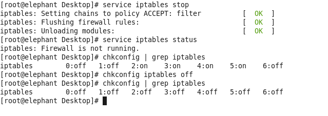
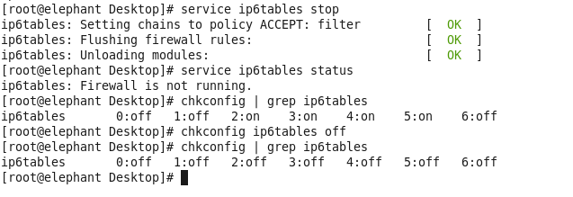

## 关闭防火墙

开启防火墙，可以阻止非指定的端口的外部访问，有利于系统安全。但是CDH集群涉及端口过多，建议新手先完全关闭防火墙，保证CDH的正常安装、连接。

### 关闭iptables
- 包括elephant, tiger, horse, monkey, lion
- 关闭服务 $ service iptables stop
- 关闭开机自启 $ chkconfig iptables off

### 关闭ip6tables
- 包括elephant, tiger, horse, monkey, lion
- 关闭服务 $ service ip6tables stop
- 关闭开机自启 $ chkconfig ip6tables off

### 其他
- $ service iptables status -> 可以检查对应服务运行状态
- $ chkconfig | grep iptables -> 可以检查对应服务在开机启动时的运行级别
	- 等级0：表示关机
	- 等级1：单用户模式
	- 等级3：有网络连接的多用户命令行模式
	- 等级4：不可用
	- 等级5：带图形界面的多用户模式
	- 等级6：重新启动
- 如果要使用防火墙的话，请上[Clouera官网](https://www.cloudera.com/)查询需要开启的端口

### 操作截图
- 关闭iptables

- 关闭ip6tables

