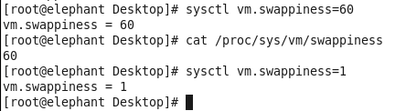
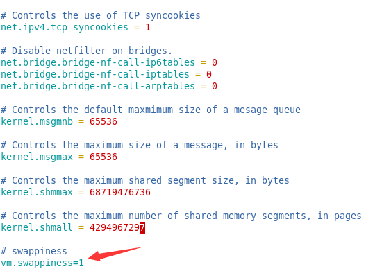

## 修改Linux的swappiness，降低对硬盘的缓存 
Linux 会使用硬盘的一部分做为SWAP分区，充当硬盘缓存。swappiness的大小决定了系统对使用硬盘缓存的倾向性，swappiness越大系统越倾向使用硬盘缓存，而不是内存。如果大量使用硬盘，而不是内存，将降低Hadoop集群作业的速度，所以应尽量调低swappiness。（系统默认swappiness为60）

推荐: 1G的内存修改为10，2G的内存修改为5，更大的设置可以为1或0

### 操作(包括5台服务器)
1. 查看swappiness 
	- $ cat /proc/sys/vm/swappiness
2. 临时修改swappiness值 
	- $ sysctl vm.swappiness=1
3. 永久修改swappiness值 
	- $ vim /etc/sysctl.conf
	- 加上/修改 vm.swappiness=1
	
注：Redhat6可以修改为0，Redhat7不支持修改为0

### 参考资料
- [Cloudera的Optimizing Performance in CDH](https://www.cloudera.com/documentation/enterprise/5-9-x/topics/cdh_admin_performance.html#cdh_performance__section_xpq_sdf_jq)

### 操作截图
- 查看和修改swappiness

- 永久修改swappiness值
 

