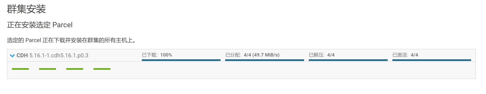
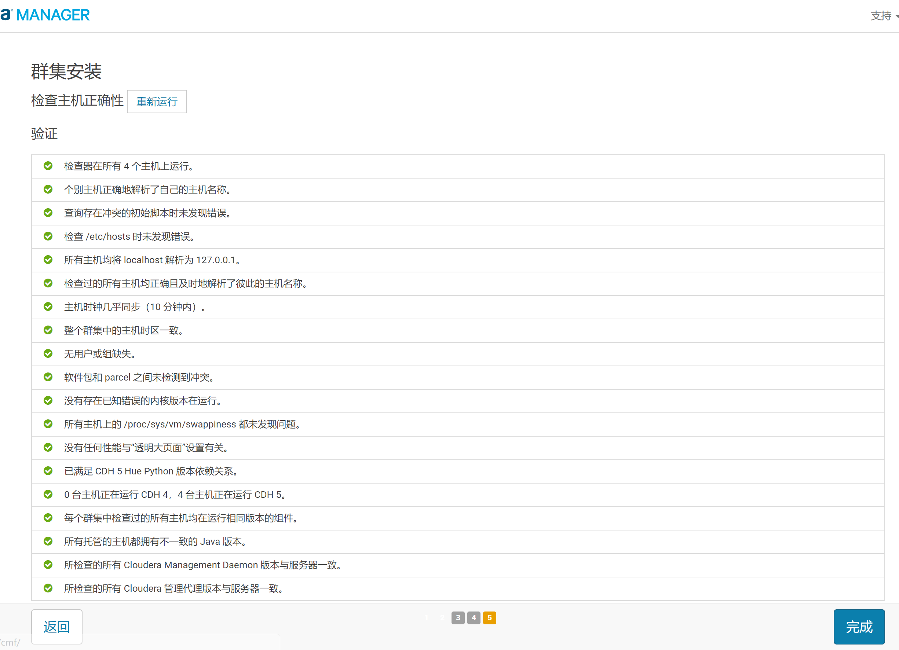
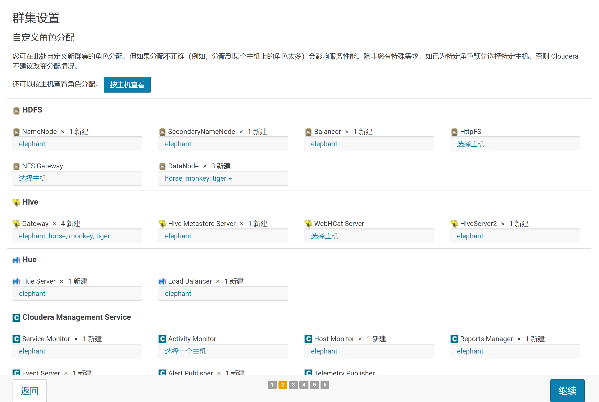
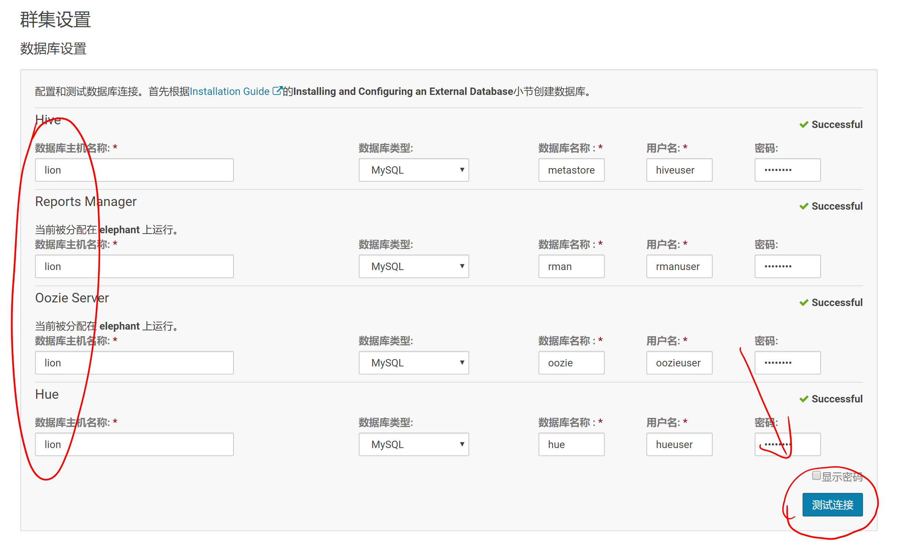
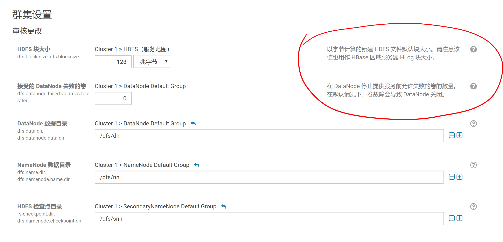
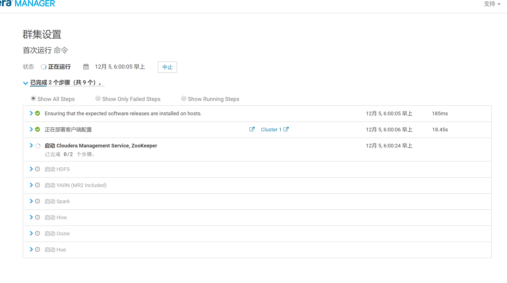
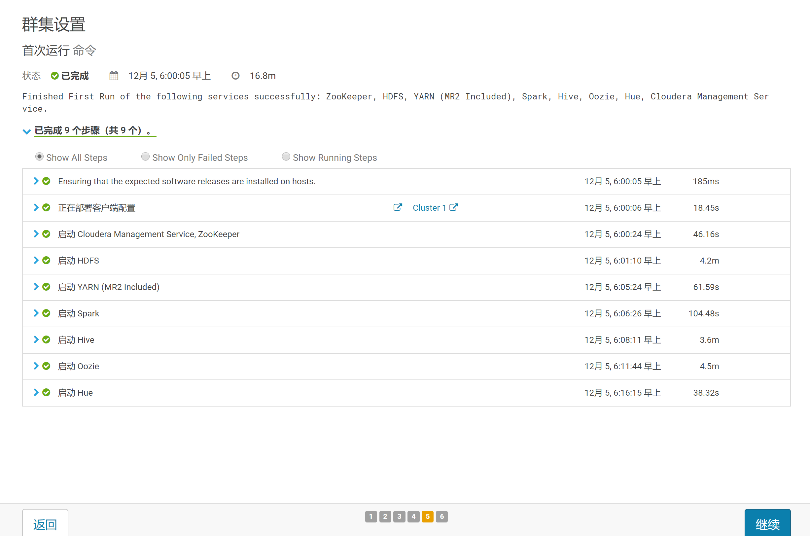
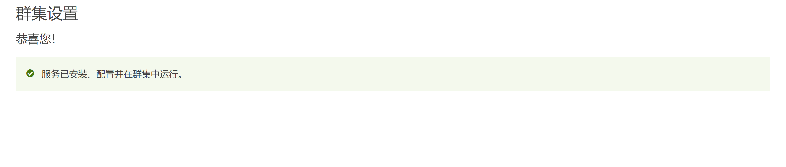
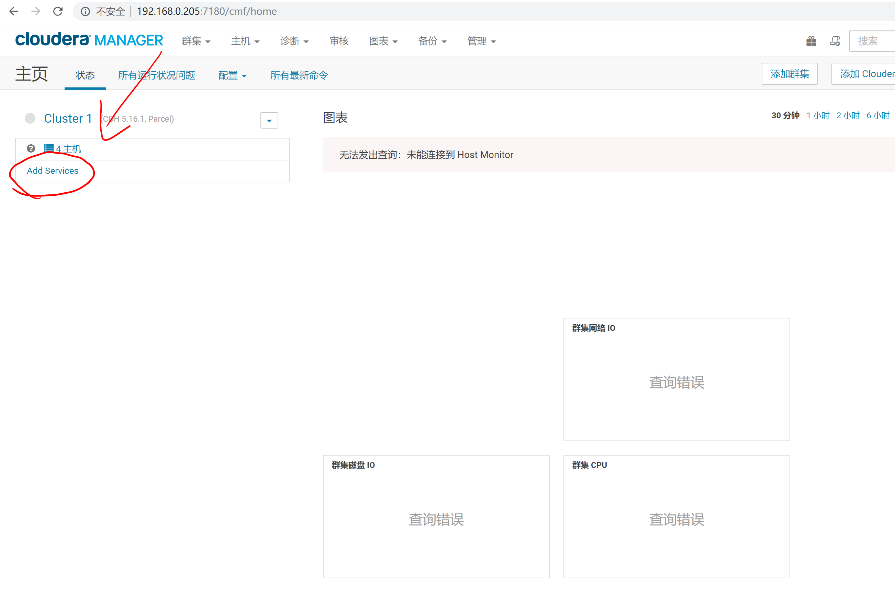

## CDH 安装

1. 开始安装CDH
  - 点击继续，安装CDH的Parcel包
  
  - 点击继续，开始检查主机正确性
  
2. 安装集群服务
  - 选择要安装的服务组合(这里我选择的Spark)
  
  - 定义角色分配，我们先默认安装Cloudera自动推荐的分配即可，不做改动
  
  - 继续，开始配置数据库设置
  - 数据库主机要对应之前安装MySQL的节点
  - 库名、用户、密码请参照前面[MySQL安装与准备](../../prepare/mysql/mysql.md)建库建用户的SQL语句
  - 配置好后，点击右下角的“测试连接”，无误后方可点击继续
  
  - 继续，来到“审核更改”处。
  - 此处采用默认值，不做修改。点击每行旁边的“？”，会有相应配置的提示。
  
  - 点击继续，开始“首次运行”，等待依次启动各个服务
  
  - 各个服务启动完毕^_^
  
  - 点击继续，完成 :)
  
 
3. 如果不小心跳出了集群服务安装页面，请看这里
  - 访问lion的CM管理界面，例如 http://192.168.0.205:7180/cmf/home
  - 点击左上角的 Add Services
  
  - 出现步骤2的界面
