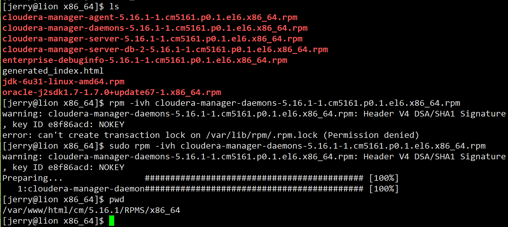
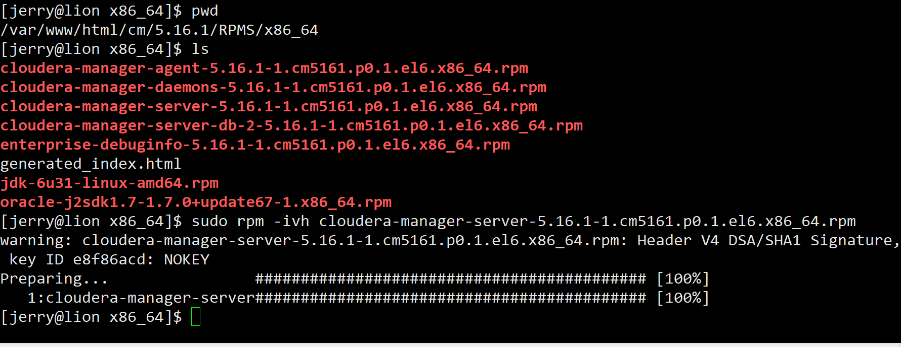
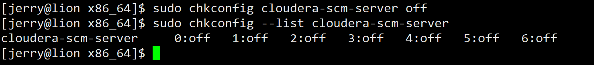
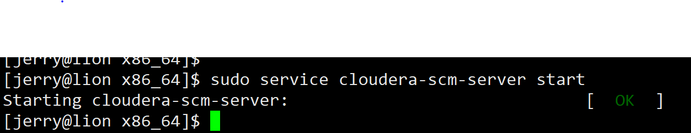

## CM安装

1. lion 检查各个软件
	- java 检查version、JAVA_HOME、PATH
	- python 检查是否是2.X版本
	- mysql 检查安全、是否启动等
	- Apache/其他 HTTP仓库是否开启
	- 其他问题
2. lion 开始安装CM server
	 - 安装 $ sudo rpm -ivh cloudera-manager-daemons cloudera-manager-server
	 
	 
	 - 关闭开机自启 $ sudo chkconfig cloudera-scm-server off 
	 
	 - 关联数据库和CM $ sudo /usr/share/cmf/schema/scm_prepare_database.sh mysql cmserver cmserveruser password
	 
	 - 显示“All done, your SCM database is configured correctly!”后，启动服务 $ sudo service cloudera-scm-server start (启动速度很慢，启动前可以虚拟机做个快照，以防启动过程出现意外，导致不得不去一个一个删掉启动时创建的一些数据，再重新开启服务)
	 - 查看日志 sudo tail -f /var/log/cloudera-scm-server/cloudera-scm-server.log
	 - 如果日志内出现7180，就可以用浏览器浏览http://lion:7180
	 
	 
3. 使用浏览器进入http://lion:7180 页面，准备安装Agent
	- 登录默认 账户:admin 密码:admin
	
	- 选择Cloudera Enterprise Data Hub Edition Trial.继续
	- 输入hostname:elephant tiger horse monkey lion，然后search，成功后继续
	- 点击 More Options 
		- 删除掉联网下载的所有项目
		- 添加本地http服务仓库地址http://lion:8000
	- 配置Cloudera Manager Agent仓库 http://lion:8050
	- 配置ssh免密登录（前面已经配置过）
	- 如果需要非root执行，需要配置对应用户的“免密码执行sudo”权限（在/etc/sudoers中添加jerry   ALL=(ALL)       NOPASSWD:ALL）
	- 5台动物服务器，mv /etc/yum.repos.d/CentOS-* /etc/yum.repos.d/bak/
	- 点击ok安装Agent，继续
4. Get2EC2 VM浏览器 安装 hadoop集群 CDH
	- 点击Custom	Services，选择HDFS YARN(MR2 Included)
	- 按文档配置集群的HDFS、CMS、YARN，继续
	- 配置数据库地址、库名、用户、密码
	- 修改日志保存位置
	- 开始安装
	- 等待安装结束，进入网页Home界面
	```
	如果出现时间不同步，检查各台服务器
	ping 192.168.1.1 是否能ping通?
	sudo ntpstat 查看是否是synchronised
	如果不是，sudo service ntpd restart
	可能要等5min才能完成同步
	```
