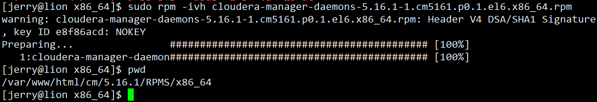
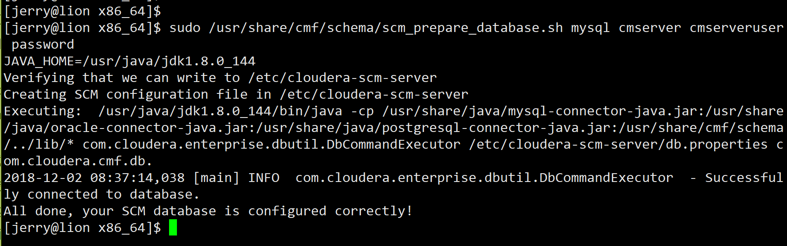
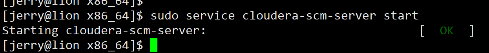

## CM安装

1. lion 检查各个软件
	- java 检查version、JAVA_HOME、PATH
	- python 检查是否是2.X版本
	- mysql 检查安全、是否启动等
	- Apache/其他 HTTP仓库是否开启
	- 其他问题
2. lion 开始安装CM server
	 - 安装 $ sudo rpm -ivh cloudera-manager-daemons cloudera-manager-server
	 
	 
	 - 关闭开机自启 $ sudo chkconfig cloudera-scm-server off 
	 
	 - 关联数据库和CM $ sudo /usr/share/cmf/schema/scm_prepare_database.sh mysql cmserver cmserveruser password
	 
	 - 显示“All done, your SCM database is configured correctly!”后，启动服务 $ sudo service cloudera-scm-server start (启动速度很慢，启动前可以虚拟机做个快照，以防启动过程出现意外，导致不得不去一个一个删掉启动时创建的一些数据，再重新开启服务)
	 - 查看日志 sudo tail -f /var/log/cloudera-scm-server/cloudera-scm-server.log
	 - 如果日志内出现7180，就可以用浏览器浏览http://lion:7180
	 
	 
3. 使用浏览器进入http://lion:7180 页面，准备安装Agent
	- 登录界面如下~^_^
	
